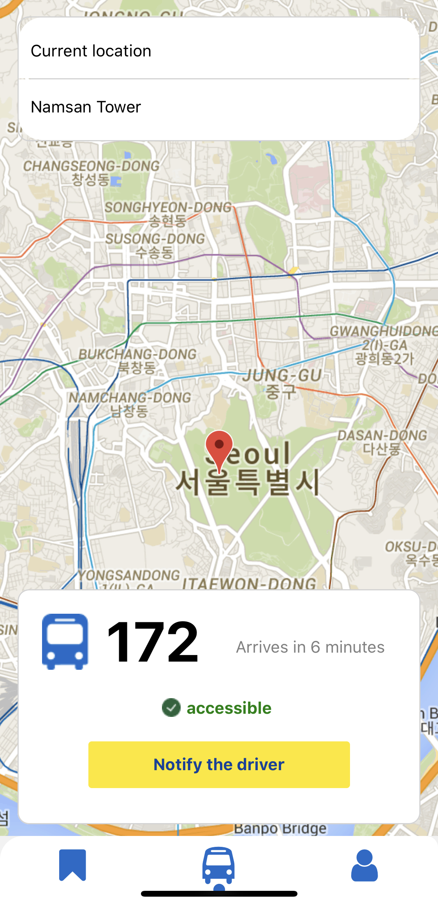

# SuperB
This is our submission for [JunctionX Seoul 2021](https://junctionx-seoul-2021.oopy.io/). Our project is a mobile app that helps to track the real-time location and route of buses and other forms of public transportation with wheelchair accessibility on the map. 

[Here]() is our video demo.

## Screenshot


## Running

From the root folder run expo server

```sh
npm i
```

Run frontend application:
```sh
npm start
```

## Contributors

- [Abdirakhman Ismail](https://github.com/abdirakhman)
- [Nargiz Askarbekkyzy](https://github.com/nargizas)
- [Aida Ospanova](https://github.com/Ospanova)
- [Nurlykhan Kopenov](https://github.com/IamNoPro)
- [Kaiyrly](https://github.com/Kaiyrly)
- [Nurlykhan Kairly](https://github.com/NurlykhanKairly)
